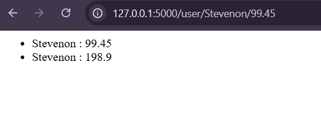

# Flask Backend Frame work doc

Quick start with flask

```py
from flask import Flask

app = Flask(__name__)

@app.route('/')
def hello_world():
    return "<p> Hello Flask</p>"
```

To run your flask you do `flask --app [file_path] run`
an example is this  `flask --app ./day54-webback1/main run`

## Basic Runing with having to use cmd

```py
from flask import Flask

app = Flask(__name__)

@app.route('/')
def hello_world():
    return "<p> Hello Flask</p>"

@app.route('/user')
def user_page():
    return "<h2> This User </h2>"

@app.route('/user/<name>/<float:price>')
def cost_page(name, price):
    return f"""
<ul>
    <li> {name} : <span>{price}</span></li>
    <li> {name} : <span>{price*2}</span></li>
<ul>
"""

if __name__ == "__main__":
    app.run(debug=True)
```



