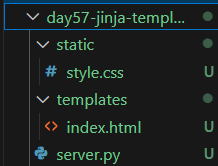
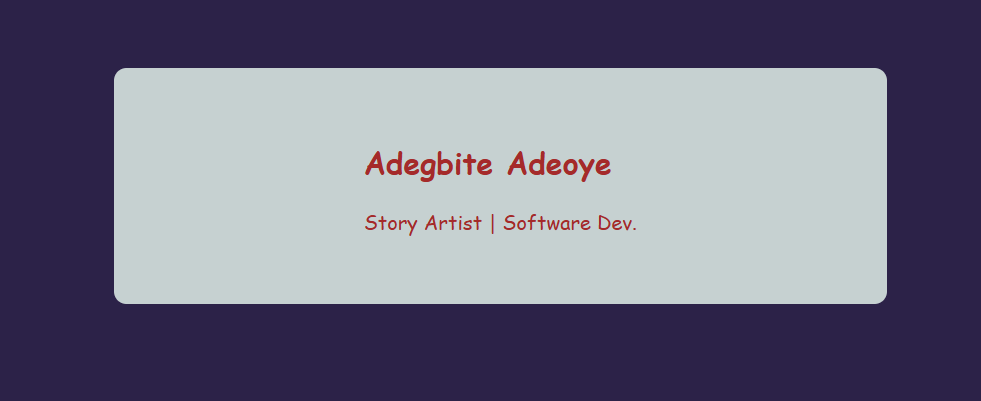
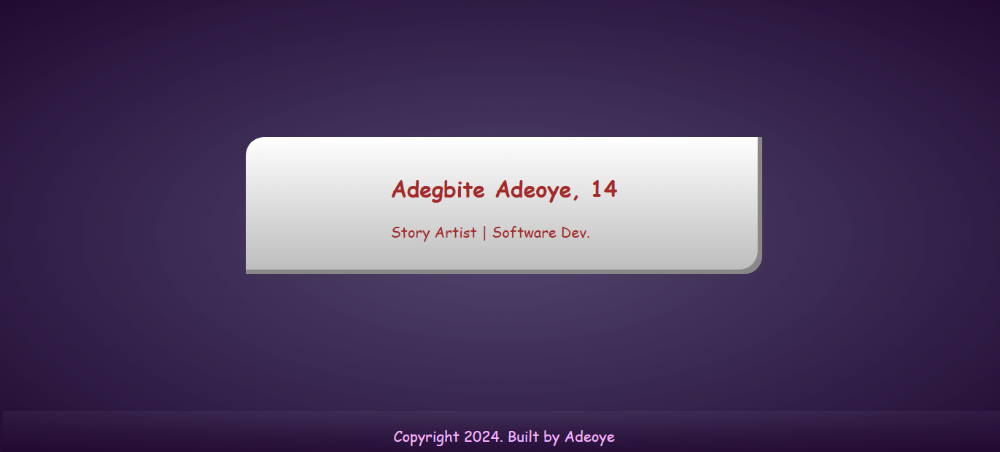
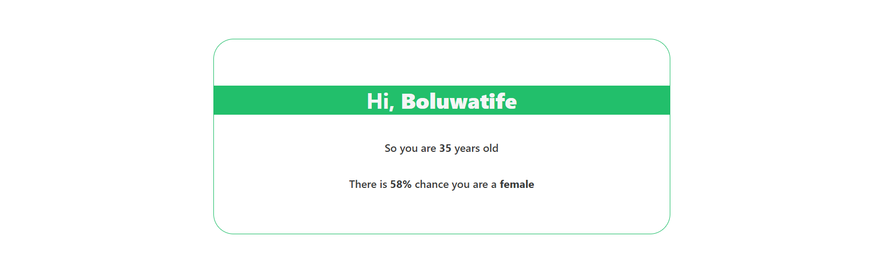
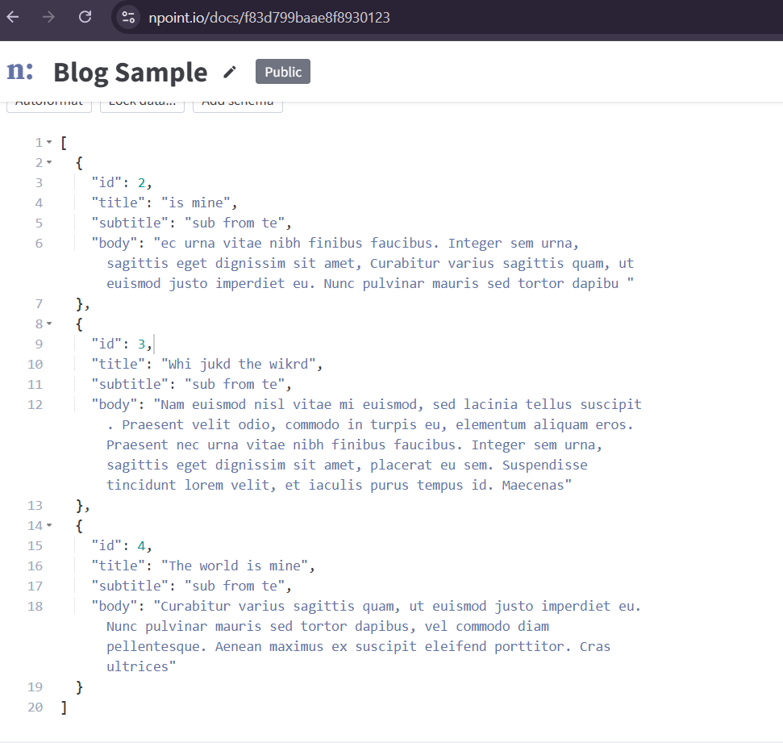
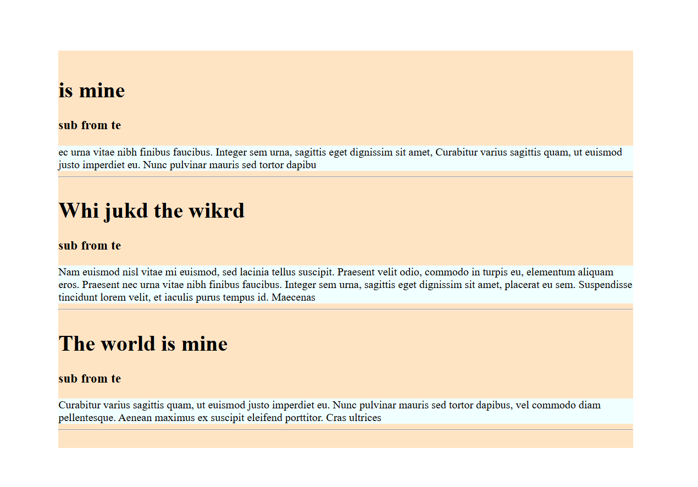

# Flask Backend Frame work doc

Quick start with flask

```py
from flask import Flask

app = Flask(__name__)

@app.route('/')
def hello_world():
    return "<p> Hello Flask</p>"
```

To run your flask you do `flask --app [file_path] run`
an example is this  `flask --app ./day54-webback1/main run`

## Basic Runing with having to use cmd

```py
from flask import Flask

app = Flask(__name__)

@app.route('/')
def hello_world():
    return "<p> Hello Flask</p>"

@app.route('/user')
def user_page():
    return "<h2> This User </h2>"

@app.route('/user/<name>/<float:price>')
def cost_page(name, price):
    return f"""
<ul>
    <li> {name} : <span>{price}</span></li>
    <li> {name} : <span>{price*2}</span></li>
<ul>
"""

if __name__ == "__main__":
    app.run(debug=True)
```


## Render html and css with `render_template`

in your project directory, you need to have the follow folders:

- `static` folder - this is where your images and css are located.
- `templates` folder - this is where you html files are located


Once you have that the following code can be executed:

```py title="server.py"
from flask import Flask, render_template

app = Flask(__name__)

@app.route('/')
def hello_world():
    return render_template("index.html") # call the html in template


if __name__ == "__main__":
    app.run(debug=True)

```

```html
<!DOCTYPE html>
...
    <!-- NOTE that stytle is in "static" directory  -->
    <link rel="stylesheet" href="static/style.css">
    <title>Adeoye</title>
</head>
<body>
    <main class="main-title">
        <div class="details">
            <h2>Adegbite Adeoye</h2>
            <p>Story Artist | Software Dev.</p>
        </div>
    </main>
    
</body>
</html>
```
<div class="grid" markdown>

<figure markdown="span" style="max-width: 200px">

</figure>

<figure markdown="span" style="width: 500px">

</figure>

</div>

## EXAMPLE : Auto Update year


```py
from flask import Flask, render_template
import random, datetime as dt

app = Flask(__name__)

@app.route('/')
def index_def():
    val = random.randint(1, 33)
    current_year = dt.datetime.now().year
    return render_template("index.html", val = val, year= current_year)

if __name__ == "__main__" :
    app.run(debug=True)
```

```html
...
<body>
    <main class="main-title">
        <div class="details">
            <h2>Adegbite Adeoye, {{val}} </h2>
            <p>Story Artist | Software Dev.</p>
        </div>
    </main>
    
    <footer class="foot-title">
        <p>Copyright {{year}}. Built by Adeoye</p>
    </footer>
</body>
</html>
```

## EXAMPLE 2: Request from Agify, Genderize



```py title="server.py"

from flask import Flask, render_template
import  requests, json


app = Flask(__name__)

@app.route('/guess/<name>')
def guess_page(name):

    result = ""
    gender = age = prob = None
    try :
            # Age data from agify
        res = requests.get(f"https://api.agify.io?name={name}")
        # result = json.loads(res.text)
        result = res.json()
        age = result['age']

        # Gender data from genderize
        res = requests.get(f"https://api.genderize.io?name={name}")
        # result = json.loads(res.text)
        result = res.json()
        gender = result["gender"]
        prob = round(result["probability"]*100)
        
    except KeyError as e:
        print(e)
        print(result)


    return render_template("guess.html", name = name.title(),
                age=age, gender = gender, prob = prob, result= result)


if __name__ == "__main__" :
    app.run(debug=True)

```


```html title="guess.html"
...
    <link rel="stylesheet" href="../static/guess-style.css">
    <title>Guess API</title>
</head>
<body>
    <main class="main-content">
        <h1>Hi, <span>{{name}} </span>    </h1>
        <p> So you are <span>{{age}}</span> years old </p>
        <p> There is <span>{{prob}}% </span>chance 
                    you are a <span>{{gender}}</span> </p>
    </main>
</body>
</html>
```

!!! Warning
    The best way to convert your api response to json object is to call the `.json()` function on the response content i.e `<response_text>.json()`
    One of the ways to convert json object to dictionary object is in the `json` module, there are two distinctive functions

    * `json.load(json_file)` - This is used specifically for loading **json files** from a directory
    * `json.loads(json_obj)` - This is for loading **json object** return from either a request or from a function etc. Note this is `json.loads` ending with a **-s**

## Multiple blog post with flask

We are going to use ["npoint.io"](https://www.npoint.io/){target=_blank} which gives use the opportunity to create our own simple api for free

<figure markdown="span">
{width=400px}
</figure>
```html title="blog.html"

<main>
    <div  data-id >
    
        <div class="blog-content" >
            <h1 class="blog-title"> {{blog['title']}} </h1>
            
            <h3 class="blog-subtitle"> {{blog['subtitle']}} </h3>
            <p class="blog-body" data-content>
                {{blog['body']}}
            </p>
            <hr>
        </div>
    
    </div >
</main>

```

```py title="server.py"

@app.route('/blog')
def blog_page():
    res = requests.get('https://api.npoint.io/f83d799baae8f8930123')
    post_data = res.json()
    print(post_data)

    return render_template('blog.html', blog_post = post_data)

```
<figure markdown="span">
{width=400px}
</figure>

