# Documentation for my Python learning

## Basic Operator operation

```bash
>>> 12*2
24

>>> "Hi!"*3 
'Hi!Hi!Hi!'

>>> 37/7.5 # normal div. float
4.933333333333334 

>>> 37//7.5 # integer/floored division
4.0

>>> 37 % 7.5  # Modulo - reminder
7.0 

```

## String concatenation and Replication

Joing string with other strings by using the `+` operator and to join with other types, you will need to convert the type into string type by using the `str` in-built function

```bash
>>> "Omolara is " + str(43) 
'Omolara is 43'
```

You can also multiply strings by an integer-type like so

```bash
>>> "Hi!"*3 
'Hi!Hi!Hi!'
```

## Converting between types

```bash
>>> str(-3.24)
'-3.24'

>>> int(55.4)
55

>>> float('3.14')
3.14
```

This is useful if for instance you are collecting integer data from the `input()` funtion. It always returns a string so you will need to parse the string into an integer. like so `age = int(input("what's your age?:"))`

## Text and Number Equivalence

Altough string value of a number is considered completely different, an integer can be equal to a float because python considered them both as number

```bash
>>> 24 == "24" 
False

>>> 24 == 24.0
True

>>> 24.0 == 00024.0000
True
```

## Some other basic Built-in function

we will talk a little bit about `round(), floor() and ceil()`

- `round()` is the typical math rounding up or down to the nearest integer `round(34.4) = 34` and `round(34.6) = 35`
- It also allow to round float to a nearest decimal places if you specify second param `round(33.34354, 3 ) = 33.344`
- `floor()` on the other just round down irrespective of the closenes so  `floor(34.4) = 34` and `floor(34.6) = 34`
- - `ceil()` r just round up irrespective of the closenes so  `ceil(34.1) = 35` and `ceil(34.6) = 35`

```bash
# round
>>> round(45.2) 
45
>>> round(45.9) 
46
>>> round(45.5) 
46
>>> round(34.0002345321, 5) 
34.00023

>>> from math import floor, ceil
# floor
>>> floor(45.4)
45
>>> floor(45.9) 
45
>>> floor(45.999) 
45

# ceil
>>> ceil(45.1)
46
>>> ceil(45.05) 
46
>>> ceil(45.9)  
46
```

## Functions

*Argument* - value being passed to a function in a function call

*Parameter* - is a local variable in a function call bracket that arguments values are assigned to them

### Working with Variables in Function

- Case 1 - Using the global value in function\
output: the global value

```python

val = "GLOBAL Value"

def fun1():
    print (val)

fun1() # prints: "GLOBAL Value"
```

- Case 2 - Assign a value to a local variable with the same name\
output: the local value

```python

val = "GLOBAL Value"

def fun1():
    val = "LOCAL Value"
    print (val)

fun1() # prints: "LOCAL Value"
print(val) # prints: "GLOBAL Value"
```

- Case 3: Assign value to the global variable from inside a function
  
```python
val = "GLOBAL Value"

def fun1():
    global val # val refer to global 'val'
    val = "LOCAL Value"
    print (val)

fun1() # prints: "LOCAL Value"
print(val) # prints: "LOCAL Value"

```

- Case 4: You can make a variable inside a function global and use it in other function

```python
def fun1():
    global val_in_fun1
    val_in_fun1 = "fun1() value"
    fun2()

def fun2():
    print ("Fun2() val = ",val_in_fun1)

fun1()
print("Global val = ", val_in_fun1)

# OUPUT:
# Fun2() val =  fun1() value
# Global val =  fun1() value
```

- Case 5: You CANNOT call a global function, then create a local variable.

```python
val = "GLOBAL Value"

def fun1():
    print(val) # Output ERROR
    val = "LOCAL Value"


fun1()
print("Global val = ", val)
```

Other examples:

```python

val = "GLOBAL Value"

def fun1():
    global val 
    val = "LOCAL Value"
    print ("local 1 = ", val)
    fun2()

def fun2():
    global val 
    val = "LOCAL 2 Value"
    print ("local 2 = ", val)

fun1()
print("Global val = ", val)

```

After all said and done its best practice to let function interact or send/receive value through each other from *parameters* and *return* values

## Exception Handling

Exception helps you avoid crashing out your program when its being run

```python
def divide(a, b):
    try:
        return a / b
    
    except ZeroDivisionError:
        return "ZeroDivError:: Cannot have a divisor of Zero"

    except TypeError:
        return "TypeError::value must be integer or float"

print(divide(6, b = 2))
print(divide(12, 0))
print(divide(11, 34))
print(divide("112", 3))
print(divide(88, 12))
```

Result:

```bash
3.0
ZeroDivError:: Cannot have a divisor of Zero
0.3235294117647059
TypeError::value must be integer or float
7.333333333333333
```

### A Short Program: Zigzag

```python
import time, sys

# how many space to indent
indent = 0 

# Whether indent is increasing or not
indentIncreasing = True 

try:
    while True: # while main prog is runnig
        print(' ' * indent, end ='')
        print("***********")
        time.sleep(0.1) # pause for 0.1 of a second

        if indentIncreasing:
            # increase the number of spaces
            indent += 1
            if indent == 10:
                # change direction:
                indentIncreasing = False
        else:
            # Decrease the number of spaces:
            indent -= 1
            if indent == 0:
                # change direction:
                indentIncreasing = True


except KeyboardInterrupt: # When user press CTRL + C
    sys.exit()
```

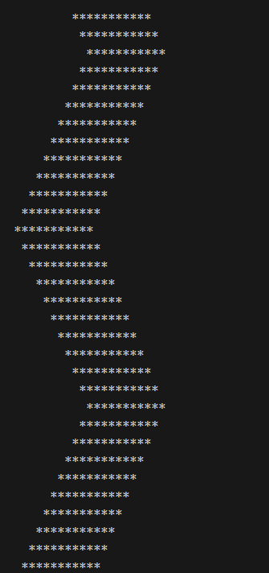

## basics with time and date

Working with basics.
(1.) `input()` and `print()`
(2.) Then we work with the type

```python

from datetime import datetime

name = input('type your name :' )
age = input('My age:')
month = input('month number: ')

months = ['jan', 'feb', 'march', 'apr', 'may', 'jun',\
           'jul', 'Aug','sep', 'oct', 'nov', 'dec']
birth_year = datetime.now().year - int(age)

print("my name is {0} and I was born in month of {1} in the year {2}"\
      .format(name, months[int(month) - 1], birth_year))
```

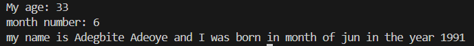

### Working with string format

simple string format, put `f'{content of string}`.

```python
game_name = 'Alphalt 9'
user_name = 'Adeoye'
str1 = f"My name is {user_name}, best game -> {game_name}"

print(str1)
```

Some more python basic string function examples

```python
method_name = "The method name is the name of company"

print(len(method_name))
print(method_name.upper())
print(method_name.lower())
print(method_name.title())

print(method_name.find('name')) # Return the index
print(method_name.replace('name', 'age'))

print('name' in method_name) # Returns true or false
print('school' in method_name)

```

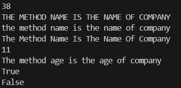

Using the format string method.

```python
weight_in_pds = input('What is your weight in pounds: ')

weight_in_kg = int(weight_in_pds) * 0.45359237

print('''if your weight in pd is {0:.3f},your weight in kg is {1:.2f}
      '''.format(int(weight_in_pds),weight_in_kg))
```

### Simple for loop demo

```python title="print F as x"
numbers = [5, 2, 5, 2, 2]

# Works for just py
for x in numbers:
    print('x' * x)

# in case of other lang
  for x in numbers:
    output = ""
    for xi in range(x+1):
        output += 'x'
    print(output)

```

The Result is\
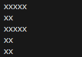

### Some list methods

```python

elist = [300, 540,  99 ,  1110, 10, 125, 44, 99]

elist.append(1104) # add to end
print('append: ',elist)

elist.insert(0, 51) # add at the beginning
print('insert: ',elist)

elist.remove(99) # remove the first occurrence of item
print('remove: ',elist)

elist.pop() # remove item at the last index
print('pop : ', elist)

elist.pop(2) # remove item at index specified
print('pop index : ', elist)

elist.clear() # removes all elements in the list
print('clear: ',elist)
```

### more list methods

```python

elist = [300, 540,  99 ,  1110, 10, 125, 44, 99]

# checking for the index of element
elist.index(34) # returns ERROR if absent

# instead check if it is in the list first
item = 1110
if item in elist :print ('item index: ',elist.index(item))
else : print('item not in list')

count =  elist.count(99) # count the occurence
print('count', count )

elist.sort() # sort order of ascending
print(elist)

elist.reverse() # sort order of descending
print(elist)
```

Result:
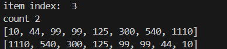

### Simple function to remove all occurence in a list

```python

# version 1 - remove all occurence
elist = [300, 540,  99 ,  1110, 10, 125, 44, 99]

def remove_all_occurence(list_of_items, item):
    for it in list_of_items:
        if it == item:
            list_of_items.remove(it)
    return list_of_items


print(remove_all_occurence(elist, 99))

# version 2 - remove all occurence
test_list = [1, 3, 4, 6, 5, 1]  
ele=1 
x=[j for i,j in enumerate(test_list) if j!=ele]  
print(x)
```

### function to remove duplicate

```python

elist = [300, 540,  99 ,  1110, 10, 125, 44, 99, 34, 67, 99, 112 , 1110]

def remove_duplicate(list_of_items):

    unique_items = []
    
    for it in list_of_items:
        # if not already in unique add it
        if it not in unique_items: 
            unique_items.append(it)
            
    return unique_items

print(remove_duplicate(elist))

```

### Dictionary in python

**Each key should be unique** in python dictionary.\
 Just like they way the words in a lang. dictionary are unique

```python
 
customer = {
    "name" : "Simon Jessie",
    "age": 34,
    "reg_date": "20-04-2019",
    "cust_id" : 1022302,
    "is_active": True,
}

# creating a new item and assigning a new dict into it
customer['cart_content']  = {0: "rifle rice", 1: "dodo beans", 12: "Atta" }

print(customer['cart_content'][12])
print(customer['reg_date'])

# This throws **ERROR** its not part of list
print(customer['total_purchase']) 

# This returns 'None' instead 
print(customer.get("total_purchase"))

# This returns 0.0, cause we are setting default value
print(customer.get("total_purchase", 0.0))

```

### Dictionary Demo Exercise - digit to word

```python
 input_data = input('phone number: ')

number_to_words = {
    "0": "Zero", "1": "One", "2" : "Two", "3" : "Three", "4": "Four"
}

# method I
new_number = []
for digit in input_data:
    new_number.append(number_to_words.get(digit, "*"))

print(" ".join(new_number))

#method II
word_number = ""
for digit in input_data:
    word_number += number_to_words.get(digit, "*") + " "

print(word_number)
```

result:
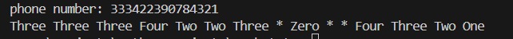

### Dictionary Demo Exercise - Emoji Converter

```python
message = input('>')

words = message.split(" ")

Emoji_coverter = {
    ":}" :"😁",  ";)": "😉",  ":(" :"☹️",  ":o": "😯"
}

output = ""

for word in words:
    output += Emoji_coverter.get(word, word) + " "

print(output)
```

## Basics of function POSITION and KEYWORD ARGS

```python

# There are four PARAMETERS in the function
def student_details(name, nickname="", age=45, score=0):
    print("============DETAILS=============")
    print(f"My name is {name}")
    print(f"My nickname is {nickname}")
    print(f"I score {score} in my exam at age {age}\n") 

# using POSITIONAL arguments only
student_details("segun", "sege", 31, 50.5)

# using POSITIONAL arguments and KEYWORD arguments
# Keyword argument is useful for clearity of what is being passed
# ERROR will occur if A Positional arg. does not preceed keyword arg.
student_details("Omotola", nickname="Tommy", age=13, score=110)

# Order of KEYWORD args does not matter
student_details(score = 0, name="kafayat",  age= 32, nickname="Kpbbp")
```

## Pathlib/Path and Modules in Python

```py
import ecommerce.cart.carter as ec
import user_details.user.create_user as cu


ec.py_carter()
cu.user("Adeoye")
print('===================')

from pathlib import Path

path = Path()
for file in path.glob("**/*.py"):
    print(file) 

```

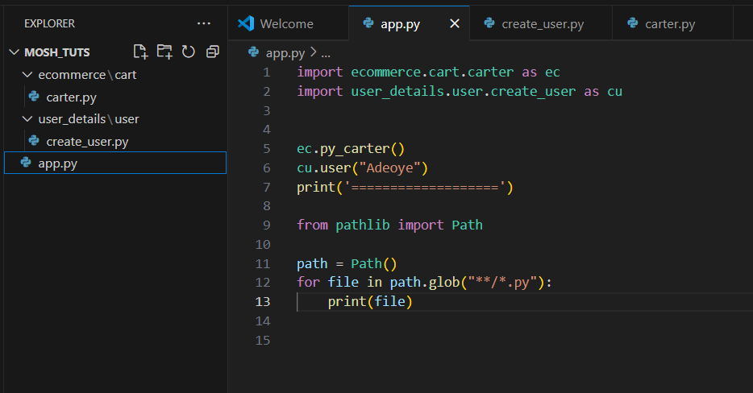

## Object Oriented Programming (OOP)

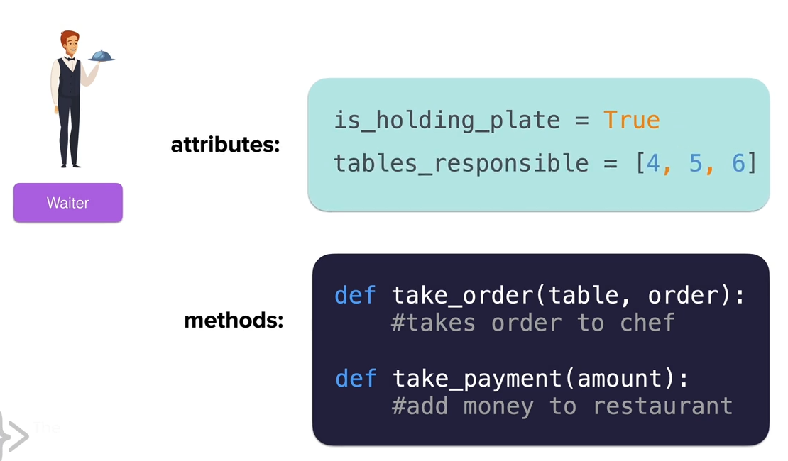

## Open and writing to file

```py

# for read files
with open("dir/to/file.txt", mode="r") as file:
    content = file.read() # or file.readlines()

# for writing
with open("dir/to/file.txt", mode="w") as file:
    file.write("this to write") 
    # it creates a new file is file not exist

with open("dir/to/file.txt", mode="a") as file:
    file.write("Add to content") 
    # same as write but append the text to end of line
```


## Working With CSV

The basic way to work with csv in python is to use the in-built `csv module` with python.

```py

import csv

with open('day25-read-csv/weather_data.csv') as data_file:
    data = csv.reader(data_file)
    for row in data:
        print(row)

```

### Extracting data

This list out the data in the csv as list

```py

data_row =[]
with open('day25-read-csv/weather_data.csv') as data_file:
    data = csv.reader(data_file)
    for row in data:
        print(row)
        data_row.append(row)

```

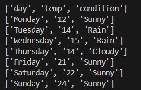

Extract all second column (temperature) excluding the first row

```py

# method 1: extract all second column
print ([temp_data[1] for temp_data in data_row[1:]])

# method 2: much longer but easier to understand
temperatures = []
for temp in data_row[1:]:
    temperatures.append(temp[1])

print(temperatures)
```

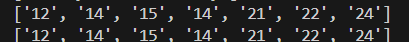

## Working with Pandas

```py

import pandas as pd

data = pd.read_csv("day25-read-csv/weather_data.csv")
print(data)
print(data['temp'])
print(type(data)) # DataFrame <class 'pandas.core.frame.DataFrame'>
print(type(data['temp'])) # Series(colums) <class 'pandas.core.series.Series'>
print(type(data[data['day'] == 'Monday'])) # <class 'pandas.core.frame.DataFrame'>
```
OUTPUT DATA
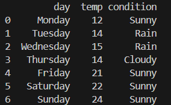

### convert csv to dictionary

```py
data = pd.read_csv("day25-read-csv/weather_data.csv")
print(data.to_dict())

'''
OUTPUT:
{'day': {0: 'Monday', 1: 'Tuesday', 2: 'Wednesday', 3: 'Thursday', 4: 'Friday', 5: 'Saturday', 6: 'Sunday'}, 

'temp': {0: 12, 1: 14, 2: 15, 3: 14, 4: 21, 5: 22, 6: 24}, 

'condition': {0: 'Sunny', 1: 'Rain', 2: 'Rain', 3: 'Cloudy', 4: 'Sunny', 5: 'Sunny', 6: 'Sunny'}}
'''
```

### Getting mean, max

```py
data = pd.read_csv("day25-read-csv/weather_data.csv")

print(data['temp'].to_list())

# finding the average
print(data['temp'].mean())
print(data['temp'].max())
```

output data:\
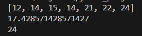

### Treating Data series like an object

```py
import pandas as pd

data = pd.read_csv("day25-read-csv/weather_data.csv")

print(data.condition)
print(data[data.day == "Wednesday"])

```

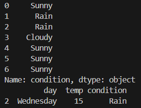

### Getting data of the max temperature

```py

data = pd.read_csv("day25-read-csv/weather_data.csv")
print(data[data.temp == data.temp.max()])

```

### Creating a DataFrame from stratch

```py
# creating DataFrame from scratch
movie_dict = {
    'movie': ["A to Z", "Movers ", "Born to Live"],
    'release_date': [1997, 2012, 2023],
    'rating' : [9.5, 1.4, 8.8]
}

# create data from movie dictionary
movie_data = pd.DataFrame(movie_dict)

# Display movie data
print(movie_data)

print(movie_data["rating"].loc[2]) # print index 2(8.8) 
# convert it to csv and save in directory
movie_data.to_csv('day25-read-csv/movie_data.csv')

```

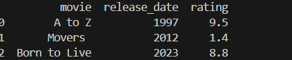


## List Comprehension in python

List comperesion applys to :

- `list`
- `range`
- `string`
- `tuple`

List comprehension with numbers

```py

list1 =[2, 3.0, 5, 3, 4.0, 33]

# square each in list
mult = [x*x for x in list1]
print(mult)

# Adding if statement
int_only = [i for i in list1 if type(i) is int ]
print(int_only)

''' RESULT:
[4, 9.0, 25, 9, 16.0, 1089]
[2, 5, 3, 33]
'''
```

List comprehension with strings

```py
my_name = "Adegbite"
letters = [letter for letter in my_name]
print(letters)

print([x*2 for x in range(1, 6)])

# RESULT: ['A', 'd', 'e', 'g', 'b', 'i', 't', 'e']

names = ["Freddie", "Alex", "Beth", "Dave", "Carolina", "Titilayo", "Tolulope"]

upper_long_names = [long_names.upper() for long_names in names if len(long_names) > 5]
print(upper_long_names)

# RESULT: ['FREDDIE', 'CAROLINA', 'TITILAYO', 'TOLULOPE']
```

### List comprehension example

```py

with open("./day26-list-comp/file1.txt") as f1:
    #conten1:  [111, 3, 6, 5, 8, 33, 12, 7, 4, 72, 2, 42, 13]
    content1 = [c.strip() for c in f1.readlines()]

with open("./day26-list-comp/file2.txt") as f2:
    #content2: [3, 6, 13, 8, 7, 89, 12, 3, 33, 34, 1, 344, 42,1090, 111]
    content2 = [c.strip() for c in f2.readlines()]

# check if 
same_content = [int(x) for x in content1 if x in content2]

print(same_content)
"""
RESULT: [111, 3, 6, 8, 33, 12, 7, 42, 13]

"""
```

### Using Zip in list comprehension

```py
with open("./day26-list-comp/file1.txt") as f1:
    content1 = [int(c.strip()) for c in f1.readlines()]

with open("./day26-list-comp/file2.txt") as f2:
    content2 = [int(c.strip()) for c in f2.readlines()]

print(content1)
print(content2)

print([ (x,y) for x, y in zip(content1, content2)])

"""=============RESULT====================

[(111, 3), (3, 6), (6, 13), (5, 8), (8, 7), (33, 89), (12, 12), (7, 3), (4, 33), (72, 34), (2, 1), (42, 344), (13, 42)]
"""

```

## Dictionary comprehensions

Here is the formats for dictionary comprehension in python

Format using a list,string,range or tuple type as iterable:
`{new_key:new_value for item in list_n}`

Format using a dict type as iterable:
`{new_key:new_value for (key, value) in dict_n.items()}`

```py

import random as r

#{new_key:new_value for item in list_n}
scores = [30, 56, 44, 34, 70, 99]
print({chr(r.randint(1, 1000)):score for score in scores})

# {new_key:new_value for (key, value) in dict_n.items()}
students ={60: "alix", 200:"alesxa", 123:"Gemini"}
print({v.title():k**2 for (k, v) in students.items()})

'''
RESULT:

{'ā': 30, 'Ǘ': 56, '˫': 44, '\x85': 34, 'Ì': 70, 'Í': 99}
{'Alix': 3600, 'Alesxa': 40000, 'Gemini': 15129}
'''
```

Another example of dictionary comprehension

```py

sentence = "What is the Air-mac speed of a unicorn glider"
print({word:len(word) for word in sentence.split(" ")})

'''
RESULT:
{'What': 4,  'is': 2, 'the': 3,
 'Air-mac': 7, 'speed': 5, 'of': 2, 
 'a': 1, 'unicorn': 7, 'glider': 6}

'''

```

## Using Dictionary comprehension with Pandas

Example code look like so
`for (index , row) in my_data_frame.iterrows():`
From this, you can access the index and individual row cells. for example
`row.name or row["name"]` as you would previously.


```py

nato_data = pd.read_csv("./day26-list-comp/nato_alphabet.csv")

print({row.letter: row.code for(index, row) in nato_data.iterrows() })

```

## Working with Many Positional Arguments(*args)

Here you can add as many values as you want.
By defaults it is all packed together in a `tuple`

```py

def add(*args):
    sum = 0
    for n in args:
        sum += n
    return sum

print(add(23, 43, 3, 2, 43))

# RESULT : 114

```

## Working with Many Keyword Arguments (**kwargs)

Here you input as many key, value pairs in a function call as `func(key1=val1, key2=val2, key3=val3, ... )`.

This is automatically packed into a  `dictionary`.

```py

def calc(init_val = 0,**kwargs):
    # loop through the content
    for key, val in kwargs.items():
        print(key, val)

    # display type and content
    print(type (kwargs), kwargs)
    init_val+= kwargs.get("add")
    init_val*= kwargs.get("mul")
    init_val/= kwargs.get("div")

    return init_val


print(calc(add = 15, div=30, mul=60)
)

'''
OUTPUT:
<class 'dict'> {'add': 15, 'div': 3, 'mul': 60}
300.0
'''
```

More example of kwarg usage

```py
class Car():
    def __init__(self, **kw) -> None:
        self.name = kw.get("name")
        self.model= kw.get("model")
        self.engine_type = kw.get("engineType")

    def car_detail(self):
        return f"name- {self.name}, model - {self.model}, engine - {self.engine_type}"


my_carlot = Car(name="MX_702", engineType="VR-34-UK")
print(my_carlot.car_detail())

```

## Normalizing Any Number

If for instance you have a range of number from 0 - 777:
`0` will be the minimum range
`1` will be the interval i.e `(1-0)/(777-0) = 1/777 =  0.00128`
`211` will then be `(221-0)/(777-0) = (221) x 1/777(interval) =0.28442`
`700` will be closer to 1.0 `(700-0)/(777-0) = (221) x 1/777(interval) =0.90009`

```py
def normalize(self, number, min_num, max_number):
        return (number - min_num)/ (max_number - min_num)
```

## OS PATH Loading Files in path

### Loading Relative, Absolute Path & basename:

```py

# Relative path
>>> os.path.relpath('./') 
'.'
>>> os.path.relpath('image_timer\imgs') 
'image_timer\\imgs'

# Absolute Path
>>> os.path.abspath('./') 
'C:\\Projects\\python_projects\\basics_to_advance'

>>> os.path.abspath('image_timer\imgs')  
'C:\\Projects\\python_projects\\basics_to_advance\\image_timer\\imgs'  

# File name (base name)
>>> os.path.basename("./image_timer/imgs/amogo.png") 
'amogo.png'

>>> a = os.path.basename("./image_timer/imgs/amogo.png") 
>>> os.path.splitext(a) 
('amogo', '.png')

```


List all the files or folders in the directory

```bash
>>> os.listdir('./docs') 
['ai-dev-docs', 'blender-docs', 'cmd-docs', ...]

>>> os.listdir('./docs/cpp_docs') 
['img', 'index.md', 'linkedlist_index.md']

>>> os.listdir('./image_timer/imgs')  
['amogo.png', 'dlogo.png', 'img001.png', 'miem.png', 'sdgd.png']
```

### Load File list using os.listdir and os.path.join

```bash
>>> import os
>>> dir = ".\image_timer\imgs" 
>>> [os.path.join(dir, img) for img in os.listdir(dir)] 

['.\\image_timer\\imgs\\amogo.png', '.\\image_timer\\imgs\\dlogo.png', '.\\image_timer\\imgs\\img001.png', '.\\image_timer\\imgs\\miem.png', '.\\image_timer\\imgs\\sdgd.png']

```

### Load File list using glob.glob

```bash
>>> [img for img in glob.glob(".\image_timer\imgs\*.png")] 
['.\\image_timer\\imgs\\amogo.png', '.\\image_timer\\imgs\\dlogo.png', '.\\image_timer\\imgs\\img001.png', '.\\image_timer\\imgs\\miem.png', '.\\image_timer\\imgs\\sdgd.png']
```

## Creating Setters and Getters in Python class

```py


class ImageViewer():
    
    def __init__(self, image_name="", thumbnail_image=None, full_image=None, 
                 image_button=None):
        
        self._name = image_name
        self._thumb_img = thumbnail_image
        self._full_img = full_image
        self._img_btn = image_button

    @property # Attribute / Getter 
    def name(self):return self._name
    @name.setter
    def name(self, val): self._name = val
    
    @property
    def full_img(self): return self._full_img
    @full_img.setter
    def full_img(self, val): self._full_img = val

    
    @property
    def thumb_img(self): return self._thumb_img
    @thumb_img.setter
    def thumb_img(self, val): self._thumb_img = val
    
    @property
    def img_btn(self): return self._img_btn
    @img_btn.setter
    def img_btn(self, val): self._img_btn = val

```


## Dumping / Loading / Updating to Json file

```py

with open(f"{app_dir}/data.json", "r") as data_file:
            json.dump(new_data, data_file, indent=4) # 'w' mode
            data = json.load(data_file) # 'r' mode
            print(data, type(data)) # <class 'dict'>

```

## Try, Except, Else and Finally

try : `Something that might cause an exception`
except: `Do this if THERE WAS an exception`
else: `Do this if THERE WERE NO exception`
finally: `Do this NO MATTER WHAT`

```py

app_dir = "day30-pwd-manager-json"
dict1 = {}
list1 = []


try:
    with open(f"{app_dir}/some_file.text", "r") as fd:
        fd.read()

    # get key 
    print(dict1["a"])

    # out of range index
    print(list1[3])

    # type error
    val = "string " + 45

except FileNotFoundError as fnferror:
    print(f"{fnferror} file not found")


except KeyError as error: # for Dictionary key that does not exist
    print(f"Key {error} does not exist")

except IndexError as error: # for index that does not exist in list
    print(f"{error}")

except TypeError as error:
    print(f"{error}")

```

Note: Error will only be caught one at a time. Just like when you program throws a normal except other code line does not get executed.

Another Example:

```py

facebook_posts = [
    {'Likes': 21, 'Comments': 2},
    {'Likes': 13, 'Comments': 2, 'Shares': 1},
    {'Likes': 33, 'Comments': 8, 'Shares': 3},
    {'Comments': 4, 'Shares': 2},
    {'Comments': 1, 'Shares': 1},
    {'Likes': 19, 'Comments': 3}
]


def count_likes(posts):

    total_likes = 0
    for post in posts:
        try:
            total_likes = total_likes + post['Likes']
        except KeyError:
            total_likes = total_likes + post.get('Likes', 0) # set default of zero
    
    return total_likes

count_likes(facebook_posts)


```

### Raising your own exception

Example:

```py
h = float(input("height(m): "))
w = float(input("weight(kg): "))


if h > 4.0:
    raise ValueError("Human height should not exceed 4 meters")
elif w > 1000:
    raise ValueError("Human weight should not excceed 1000 kg")
else:
    bmi = w / h **2
    print(f"Your bmi is {bmi}")
```
