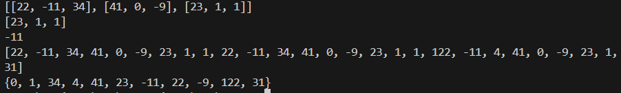

# Documentation for my Python learning

## basics

Working with basics.
(1.) `input()` and `print()`
(2.) Then we work with the type

```python

from datetime import datetime

name = input('type your name :' )
age = input('My age:')
month = input('month number: ')

months = ['jan', 'feb', 'march', 'apr', 'may', 'jun',\
           'jul', 'Aug','sep', 'oct', 'nov', 'dec']
birth_year = datetime.now().year - int(age)

print("my name is {0} and I was born in month of {1} in the year {2}"\
      .format(name, months[int(month) - 1], birth_year))
```


### Working with string format

simple string format, put `f'{content of string}`.

```python
game_name = 'Alphalt 9'
user_name = 'Adeoye'
str1 = f"My name is {user_name}, best game -> {game_name}"

print(str1)
```

Some more python basic string function examples

```python
method_name = "The method name is the name of company"

print(len(method_name))
print(method_name.upper())
print(method_name.lower())
print(method_name.title())

print(method_name.find('name')) # Return the index
print(method_name.replace('name', 'age'))

print('name' in method_name) # Returns true or false
print('school' in method_name)

```


Using the format string method.

```python
weight_in_pds = input('What is your weight in pounds: ')

weight_in_kg = int(weight_in_pds) * 0.45359237

print('''if your weight in pd is {0:.3f},your weight in kg is {1:.2f}
      '''.format(int(weight_in_pds),weight_in_kg))
```

### Simple for loop demo

```python title="print F as x"
numbers = [5, 2, 5, 2, 2]

# Works for just py
for x in numbers:
    print('x' * x)

# in case of other lang
  for x in numbers:
    output = ""
    for xi in range(x+1):
        output += 'x'
    print(output)

```

The Result is


## List in Python

```python
# Example of a 3-tensor list
mat =[  
    [[22, -11, 34],
    [41, 0, -9],
    [23, 1, 1]]
    ,
    [[22, -11, 34],
    [41, 0, -9],
    [23, 1, 1]]
    ,
    [[122, -11, 4],
    [41, 0, -9],
    [23, 1, 31]]
    ]

# looping through
item = []
for i in mat:
    for j in i:
        for k in j: 
            item.append(k)

# printing in different levels of indexes
print(mat[1]) 
print(mat[0][2])
print(mat[2][0][1])


print(item) # list all the item in 3 tensor           
print(set(item)) # remove duplicate in list
```

result:


### Some list methods

```python

elist = [300, 540,  99 ,  1110, 10, 125, 44, 99]

elist.append(1104) # latest energy
print('append: ',elist)

elist.insert(0, 51) # initial energy consumed
print('insert: ',elist)

elist.remove(99) # remove the first occurrence of item
print('remove: ',elist)

elist.pop() # remove item at the last index
print('pop : ', elist)

elist.pop(2) # remove item at index specified
print('pop index : ', elist)

elist.clear() # removes all elements in the list
print('clear: ',elist)
```

### more list methods

```python

elist = [300, 540,  99 ,  1110, 10, 125, 44, 99]

# checking for the index of element
elist.index(34) # returns ERROR if absent

# instead check if it is in the list first
item = 1110
if item in elist :print ('item index: ',elist.index(item))
else : print('item not in list')

count =  elist.count(99) # count the occurence
print('count', count )

elist.sort() # sort order of ascending
print(elist)

elist.reverse() # sort order of descending
print(elist)
```
Result:


### Simple function to remove all occurence in a list

```python

# version 1 - remove all occurence
elist = [300, 540,  99 ,  1110, 10, 125, 44, 99]

def remove_all_occurence(list_of_items, item):
    for it in list_of_items:
        if it == item:
            list_of_items.remove(it)
    return list_of_items


print(remove_all_occurence(elist, 99))

# version 2 - remove all occurence
test_list = [1, 3, 4, 6, 5, 1]  
ele=1 
x=[j for i,j in enumerate(test_list) if j!=ele]  
print(x)
```

### function to remove duplicate

```python

elist = [300, 540,  99 ,  1110, 10, 125, 44, 99, 34, 67, 99, 112 , 1110]

def remove_duplicate(list_of_items):

    unique_items = []
    
    for it in list_of_items:
        # if not already in unique add it
        if it not in unique_items: 
            unique_items.append(it)
            
    return unique_items


print(remove_duplicate(elist))

```

### Unpacking a list or tuple

```python
names = ['45',' 45, ', 'Adeoye', 55]

# Unpacking a list or tuple
n1, n2, n3, n4 = names

print(n1, n2, n3)

```

### Dictionary in python

**Each key should be unique** in python dictionary.\
 Just like they way the words in a lang. dictionary are unique

 ```python
 
customer = {
    "name" : "Simon Jessie",
    "age": 34,
    "reg_date": "20-04-2019",
    "cust_id" : 1022302,
    "is_active": True,
}

# creating a new item and assigning a new dict into it
customer['cart_content']  = {0: "rifle rice", 1: "dodo beans", 12: "Atta" }

print(customer['cart_content'][12])
print(customer['reg_date'])

# This throws **ERROR** its not part of list
print(customer['total_purchase']) 

# This returns 'None' instead 
print(customer.get("total_purchase"))

# This returns 0.0, cause we are setting default value
print(customer.get("total_purchase", 0.0))

 ```

 ### Dictionary Demo Exercise - digit to word

 ```python
 input_data = input('phone number: ')

number_to_words = {
    "0": "Zero", "1": "One", "2" : "Two", "3" : "Three", "4": "Four"
}

# method I
new_number = []
for digit in input_data:
    new_number.append(number_to_words.get(digit, "*"))

print(" ".join(new_number))

#method II
word_number = ""
for digit in input_data:
    word_number += number_to_words.get(digit, "*") + " "

print(word_number)
 ```

result:


### Dictionary Demo Exercise - Emoji Converter

```python
message = input('>')

words = message.split(" ")

Emoji_coverter = {
    ":}" :"😁",  ";)": "😉",  ":(" :"☹️",  ":o": "😯"
}

output = ""

for word in words:
    output += Emoji_coverter.get(word, word) + " "

print(output)
```

## Basics of function POSITION and KEYWORD ARGS

```python

# There are four PARAMETERS in the function
def student_details(name, nickname="", age=45, score=0):
    print("============DETAILS=============")
    print(f"My name is {name}")
    print(f"My nickname is {nickname}")
    print(f"I score {score} in my exam at age {age}\n") 

# using POSITIONAL arguments only
student_details("segun", "sege", 31, 50.5)

# using POSITIONAL arguments and KEYWORD arguments
# Keyword argument is useful for clearity of what is being passed
# ERROR will occur if A Positional arg. does not preceed keyword arg.
student_details("Omotola", nickname="Tommy", age=13, score=110)

# Order of KEYWORD args does not matter
student_details(score = 0, name="kafayat",  age= 32, nickname="Kpbbp")
```


## Pathlib/Path and Modules in Python

```py
import ecommerce.cart.carter as ec
import user_details.user.create_user as cu


ec.py_carter()
cu.user("Adeoye")
print('===================')

from pathlib import Path

path = Path()
for file in path.glob("**/*.py"):
    print(file) 

```

