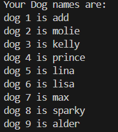

# List, Dict and Strings

## List

A *List* collection of values of data types (float, int, string even list itself) that starts with a `[` and end with `]`.

You getting value from List with indexes

```python
animal = ['dog', 'cat', 'chicken']

# access index
animal[0] # dog
animal[2] # chicken
```

if you attempt to get the value beyond the list index say `animal[100]` in get an IndexError.

List can contain other list :

```python
# Example of a 3-tensor list
mat =[  
        [
            [22, -11, 34],
            [41, 0, -9],
            [23, 1, 1]
        ]
    ,
        [
            [22, -11, 34],
            [41, 0, -9],
            [23, 1, 1]
        ]
 
    ]

# looping through
item = []
for i in mat:
    for j in i:
        for k in j: 
            item.append(k)

# printing in different levels of indexes
print(mat[1]) 
print(mat[0][2])
print(mat[1][0][2])

print(item) # list all the item in 3 tensor           
print(set(item)) # remove duplicate in list
```

result:


### Using Negative index

You can use negetive indexes to access the value of the list from behind like so:

```python
animal = ['cat', 'chicken', 'cow', 'elephant']

animal[-1] # elephant
animal[-2] # cow
```

## Getting List from Another list

With indexes, you get a single value from a list but with list, you get collection of value from a *slice of the old list* if you may say.

```python
animal = ['cat', 'chicken', 'cow', 'elephant']

animal[0:2] # [cat, chicken]
animal[1:4] # ['chicken', 'cow', 'elephant']

# short form leave out one or both of index
animal[2:] # ['cow', 'elephant']
animal[:2] # ['cat', 'chicken']

# this returns  the whole list
animal[:]  # ['cat', 'chicken', 'cow', 'elephant']

# Then we have the negative slice
animal[-1: -3] # ['chcken', 'cow']

```

## Change value in list

You can change a list value by accessing the index and assigning the value from there:

```python
animal = ['cat', 'chicken', 'cow', 'elephant']

animal[2] = 234
>>> animal
['cat', 'chicken', 234, 'elephant']

>>> animal[-1] = 'aadvark' 
>>> animal
['cat', 'chicken', 234, 'aadvark']
```

## Concatenation and Replication

Just like strings, list can be concate or repeated.

```python
>>> num = [1, 2, 3] 

>>> num + [3, 4, 8] 
[1, 2, 3, 3, 4, 8]

>>> num * 3
[1, 2, 3, 1, 2, 3, 1, 2, 3]
```

## Remove value from list

To remove value based on index, we can use `del` statement.

```python
anim = ['cat', 'chicken', 234, 'aadvark']
del anim[2]

anim # ['cat', 'chicken', 'aadvark']
```

## Working with List

Example of working with list:

```python

dogs = []

while True:
    dogName = input("Your dog name :")

    if dogName == '': break

    # concatenate dog name
    dogs = dogs + [dogName]

print("Your Dog names are:")
for index, dog in enumerate(dogs):
    print(f"dog {index + 1} is {dog}")
```

The result:



A common python technique is to use `range(len(somelist))` to access the index and the value contained in a list

```python

officeItems = ['pen', 'stapler', 'stringBall', 'laptop']

for i in range(len(officeItems)):
    print(f'index {i} in offices is : {officeItems[i]}')

'''
OUTPUT:
index 0 in offices is : pen
index 1 in offices is : stapler
index 2 in offices is : stringBall
index 3 in offices is : laptop
''' 
```

### Unpacking a list or tuple

```python
names = ['45',' 45, ', 'Adeoye', 55]

# Unpacking a list or tuple
n1, n2, n3, n4 = names

print(n1, n2, n3)

```

!!! warning " Unpack Errors"
     if you try assign less or more variables than the values in list you will get a ***ValueError*** say it either not enough to unpack or too many values to unpack.

## random.choice and random.shuffle

`random.choice` takes in a list returns a random value in  the list.

`random.shuffle` takes in a list a re-arrange the values in the list randomly. It modifies the list

```py
import random

list1 = ["Cat", "Dog", "Mouse", "house"]

print(random.choice(list1))
print(random.choice(list1))
print(random.choice(list1))
print(random.choice(list1))

list2 = [1, 2, 3, 4, 5, 6]

random.shuffle(list2)
print(list2)

random.shuffle(list2)
print(list2)

random.shuffle(list2)
print(list2)

'''
OUTPUT:
Cat
Dog
Mouse
Dog
[4, 2, 6, 3, 5, 1]
[2, 3, 1, 6, 4, 5]
[5, 2, 4, 1, 6, 3]
'''
```

## index, Append and Insert to list

```py

pets = ["Cat", "Dog", "Mouse", "Babbit"]

# find index of mouse
print(pets.index("Mouse"))

# place at the back
pets.append("Hamster")
print(pets)

# place at the index specified, shift other value
pets.insert(0, "Parrot") # insert in first
print(pets)

pets.insert(3, "Monkey")
print(pets)

'''
OUTPUT:
['Cat', 'Dog', 'Mouse', 'Babbit', 'Hamster']
['Parrot', 'Cat', 'Dog', 'Mouse', 'Babbit', 'Hamster']
['Parrot', 'Cat', 'Dog', 'Monkey', 'Mouse', 'Babbit', 'Hamster']
'''

```

When there is duplicate, the `.index()`returns the first elements index

## remove values with Remove(), pop() and del

Previously we've talke about how to remove list value with `del` statements. Now we will look into other methods.

```py
pets = ["Parrot","Cat", "Dog", "Mouse", "Babbit", "Hamster"]
print(pets)
# using remove() - specify name
pets.remove("Hamster")
print("remove('Hamster') - ", pets)

# using pop() - Specify index just like del
pets.pop(2)
print("pop(2) -            " , pets)

del pets[2]
print("del[2] -            ", pets)

'''
OUTPUT:
['Parrot', 'Cat', 'Dog', 'Mouse', 'Babbit', 'Hamster']
remove('Hamster') -  ['Parrot', 'Cat', 'Dog', 'Mouse', 'Babbit']
pop(2) -             ['Parrot', 'Cat', 'Mouse', 'Babbit']
del[2] -             ['Parrot', 'Cat', 'Babbit']

'''
```

## Sort() method

usage

```py
some_num = [23, -33, 5, 3,0, 1100, 29]
some_name = ["aark", "Adeob", "Yeshy", "yeye", "Bibola"]

print("Normal sorting: === ")
some_num.sort()
some_name.sort()

print(some_num)
print(some_name)

print("\nSpecial sorting: === ")
some_num.sort(reverse=True) # reverse sort
some_name.sort(key=str.lower) # sort regular alphabet

print(some_num)
print(some_name)

'''
Normal sorting: === 
[-33, 0, 3, 5, 23, 29, 1100]
['Adeob', 'Bibola', 'Yeshy', 'aark', 'yeye']

Special sorting: ===
[1100, 29, 23, 5, 3, 0, -33]
['aark', 'Adeob', 'Bibola', 'Yeshy', 'yeye']
'''
```

Example code for reversing a list

```py
# reverse list example
other_list = [3, 23, 4, "Ade", "Laboo", True, 34.0]
other_list.reverse()
print(other_list)

'''OUTPUT
[34.0, True, 'Laboo', 'Ade', 4, 23, 3]
'''
```

### List Code Example - Magic 8 balls list version

```py
import random

messages =[
    'It is certain',
    'Its is decided so',
    'Yes definitely',
    'Rely quickly and try',
    'I said no',
    'Are you ok? I said yes',
    'This is not lookin good',
    "Good speed sergeant"
]

print(messages[random.randint(0,len(messages)-1)])
```