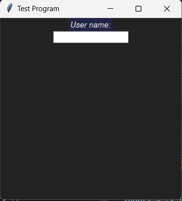
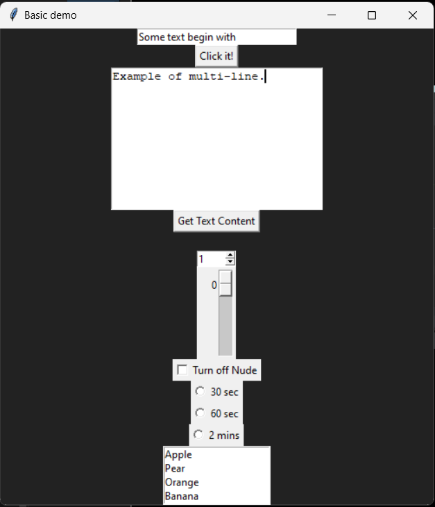
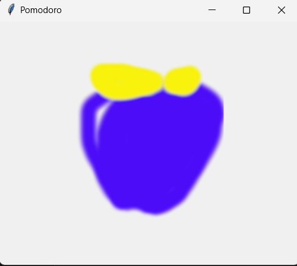
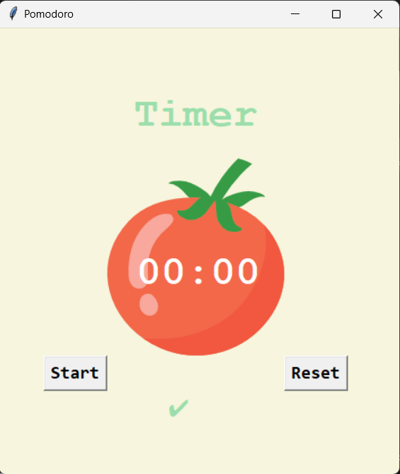
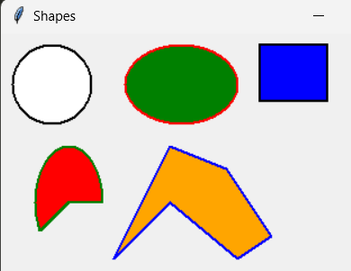
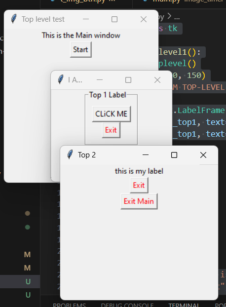
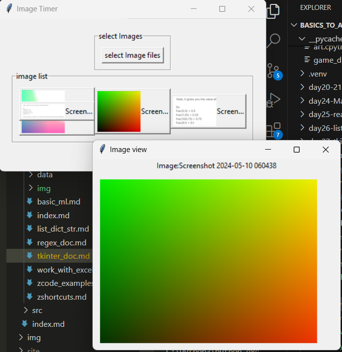

# Introduction to Tkinter

## Basic examples

Basic example here 

```py

import tkinter as tk

BG_COLOR = "#222"
FG_COLOR = "#eee"

window_tk = tk.Tk()

# create window basic
window_tk.title("Test Program")
window_tk.minsize(width=300, height=300)
window_tk.config(bg=BG_COLOR)


# Label example
label1 = tk.Label(text="User name:", font=("Cursive", 10, "italic"))
label1.config(bg=f"{BG_COLOR}444", fg=FG_COLOR)
label1.pack()

# Entry
input1 = tk.Entry()
input1.pack()

window_tk.mainloop()

```

Output:



## Introducing other Tkinter widget


```py

import tkinter as tk

BG_COLOR = "#222"
FG_COLOR = "#eee"


win = tk.Tk()
win.title("Basic demo")
win.minsize(width=500, height=500)
win.config(bg=BG_COLOR)

# Entries==============================#
entry = tk.Entry(width=30)

# Add some text to begin with
entry.insert(tk.END, string="Some text begin with")
print(entry.get()) # Get text in entry
entry.pack()

# Button===============================#
def action(): print("Btn: Just do it!")
btn = tk.Button(text="Click it!", command=action).pack()

# Text Widget =========================#
text = tk.Text(height=10, width=30)
text.focus() # Puts cursor in textbox
text.insert(tk.END, "Example of multi-line.") # Text to begin with

# '1.0' means get line "1" from "0" character
print()
text.pack()

# Get the Text Content
def text_action(): 
    text_val = text.get("1.0", tk.END)
    label1.config(text=text_val)

btn1 = tk.Button(text="Get Text Content", command=text_action)
btn1.pack()
label1 = tk.Label(text="", fg=FG_COLOR, bg=BG_COLOR)
label1.pack()

# SpinBox ===================>
def spinbox_action(): print(spinbox.get())

spinbox = tk.Spinbox(from_=1, to=6, width=5, command=spinbox_action)
spinbox.pack()


# Scale =====================>
def scale_action(value): print(value)

scale = tk.Scale(from_=0, to=100, command=scale_action)
scale.pack()

# CheckBox ==================>
def checkbtn_action():
    # print '1' - ON,  '0' - OFF
    print(checked_state.get())

# variable to hold check
checked_state = tk.IntVar()

checkbutton = tk.Checkbutton(text="Turn off Nude", variable=checked_state, command=checkbtn_action)
checkbutton.pack()

# Radio Button ==============>
def radio_action():
    print(radio_state.get())

# variable to hold which value is checked
radio_state = tk.IntVar()

radiobtn1 = tk.Radiobutton(text="30 sec", value=30, variable=radio_state, command=radio_action)
radiobtn2 = tk.Radiobutton(text="60 sec", value=60, variable=radio_state, command=radio_action)
radiobtn3 = tk.Radiobutton(text="2 mins", value=99, variable=radio_state, command=radio_action)
radiobtn1.pack()
radiobtn2.pack()
radiobtn3.pack()


# List Box ================>
def listbox_action(event):
    # Get current selection from listbox
    print(listbox.get(listbox.curselection()))

fruits = ["Apple", "Pear", "Orange", "Banana"]

listbox = tk.Listbox(height=4)
for i in range(len(fruits)): listbox.insert(i, fruits[i])

listbox.bind("<<ListboxSelect>>", listbox_action) # Attach to the function
listbox.pack()

win.mainloop()

```

## Basic image loading

```py

root = tk.Tk()
root.title("Pomodoro")
root.config(padx=100, pady=50)

# Create the canvas 
canvas = tk.Canvas(width=200, height=224)

# loading image
tomato_img = tk.PhotoImage(file="day28-pomodoro/blue_apple.png")
canvas.create_image(103, 112, image = tomato_img)
canvas.pack()


root.mainloop()

```

Result



## Full UI setup for Pomodoro


```py
# ---------------------------- UI SETUP
root = tk.Tk()
root.title("Pomodoro")
root.config(padx=50, pady=50, bg=YELLOW)

# Timer Stage label
timer_stage_label = tk.Label(text="Timer", fg=GREEN, bg=YELLOW, font=(FONT_NAME, 35, "bold"), pady=20)
timer_stage_label.grid(row=0, column=1)

# Create the canvas 
canvas = tk.Canvas(width=200, height=224, bg=YELLOW, highlightthickness=0)

# loading image
tomato_img = tk.PhotoImage(file="day28-pomodoro/tomato.png")
canvas.create_image(100, 112, image = tomato_img)
canvas.create_text(103, 130, text="00:00", fill="white", font=(FONT_NAME, 35, "bold" ))
canvas.grid(row=1, column=1)

# Start Button
start_btn = tk.Button(text="Start", font=BUTTON_FONT)
start_btn.grid(row=2, column=0)

# Reset Button
reset_btn = tk.Button(text="Reset", font=BUTTON_FONT)
reset_btn.grid(row=2, column=2)

# Check mark Label
marks_label= tk.Label(text="✔️", fg=GREEN, bg=YELLOW, font=("Arial", 20))
marks_label.grid(row=3, column=1)

```




## Canvas Shapes in Tkinter

```py

import tkinter as tk 

class Shape:
    def __init__(self, main = None):
        self.main = main
         
        # Calls create method of class Shape
        self.create()
     
    def create(self):
         
        # Creates a object of class canvas
        # with the help of this we can create different shapes
        self.canvas = tk.Canvas(self.main)
 
        # Creates a circle of diameter 80
        self.canvas.create_oval(10, 10, 80, 80, 
                            outline = "black", fill = "white",
                            width = 2)
         
        # Creates an ellipse with H. diameter: 210 and V. diameter: 80
        self.canvas.create_oval(110, 10, 210, 80,
                            outline = "red", fill = "green",
                            width = 2)
         
        # Creates a rectangle of 60 x 50 (width x height)
        self.canvas.create_rectangle(230, 10, 
                                     290, # pos_x(230) + width(60)
                                      60, # pos_y(10) + height(50)
                                outline = "black", fill = "blue",
                                width = 2)
         
        # Creates an arc of 210 deg (it also have soval shape of 90, 100)
        self.canvas.create_arc(30, 200, 90, 100, start = 0,
                          extent = 210, outline = "green",
                          fill = "red", width = 2)
         
        points = [150, 100, 200, 120, 240, 180,
                  210, 200, 150, 150, 100, 200]
         
        # Creates a polygon
        self.canvas.create_polygon(points, outline = "blue",
                              fill = "orange", width = 2)
        # Pack the canvas to the main window and make it expandable
        self.canvas.pack(fill = tk.BOTH, expand = 1)
 
if __name__ == "__main__":
     
    # object of class Tk, responsible for creating
    # a tkinter toplevel window
    root = tk.Tk()
    shape = Shape(root)
 
    # Sets the title to Shapes
    root.title("Shapes")
 
    # Sets the geometry and position
    # of window on the screen
    root.geometry("400x300")
 
    # Infinite loop breaks only by interrupt
    root.mainloop()

```



The document was originally from [geeksforgeeks](https://www.geeksforgeeks.org/python-tkinter-create-different-shapes-using-canvas-class/)


## Loading image to Tkinter

### load_tk_image function

```py
import tkinter as tk
from PIL import ImageTk, Image


def load_image(filepath, new_width = None, new_height= None, reduce_by=1) :
    '''
    This loads image using Image class from the PIL Library

    Parameters: 
    filepath (string) : path to the image file
    new_width (int) : Specify new resize width, None if not specified
    new_height (int) : specify new resize height, None if not specified
    reduce_by(float) : proportional resizing by value specified

    Returns:
    Image : PIL class for Images '''
    
    import math
    img = Image.open(filepath)

    if new_width and new_height:
        img = img.resize((new_width, new_height))

    elif new_width and not new_height:
        aspect_ratio = img.size[1]/img.size[0]
        img = img.resize((new_width, math.floor(new_width*aspect_ratio)))
    
    elif new_height and not new_width:
        aspect_ratio = img.size[0] /img.size[1]
        img = img.resize((math.floor(new_height*aspect_ratio), new_height))
    
    elif reduce_by < 1:
        img = img.resize((math.floor(img.size[0]*reduce_by), # height
                            math.floor(img.size[1]*reduce_by))) # weight

    return img


```

### Loading single image

```py  
# MAIN ==========================================

mw = tk.Tk()
mw.geometry("400x400")
mw.title("Img Btn text")


img1 = load_image("image_timer/imgs/amogo.png", 100)
img_btn = tk.Button(image=img1, compound=tk.LEFT, text="Sample 1")
img_btn.pack()

mw.mainloop()
```
<figure markdown="span">

</figure>

### Loading multiple Images pack view

```py linenums="1"
mw = tk.Tk()
mw.geometry("400x400")
mw.title("Img Btn text")

img_btn_list={} # Container to hold the images
for img in glob.glob("image_timer\imgs\*.png"):
    
    img1 =  ImageTk.PhotoImage(load_image(img, 100))
    name = os.path.splitext(os.path.basename(img))[0] # get the name
    img_btn = tk.Button(image=img1, compound=tk.LEFT, text=name)
    img_btn.pack()
    img_btn_list.setdefault(img1, img_btn)

mw.mainloop()
```
<figure markdown="span">


</figure>

### Loading multiple Images in Grid View

```py
# ... def load_image 

mw = tk.Tk()
mw.geometry("400x400")
mw.title("Img Btn text")

img_btn_list={} # Container to hold the images
index = 0
for img in glob.glob("image_timer\imgs\*.png"):
    row = index//3
    col =  index%3
    img1 = ImageTk.PhotoImage(load_image(img, 70))
    
    name = os.path.splitext(os.path.basename(img))[0] # get the name

    img_btn = tk.Button(image=img1, compound=tk.LEFT, 
                        text= f"{name[:6]}..." if len(name)> 6 else name )
    img_btn.grid(row=row ,column=col)
    img_btn_list.setdefault(img1, img_btn)
    index+=1

mw.mainloop()
```
<figure markdown="span">


</figure>


### Choose Image & Loading Multiple Images in grid View

```py linenums="1"

# ... def load_image 

def openfile():
    new_img_files = fd.askopenfilenames(parent=win, title="Choose a File")
    print(win.splitlist(new_img_files))

    display_images(new_img_files)


img_btn_list={} # Container to hold the images

def display_images(img_files):
    index = 0
    # for img in glob.glob("image_timer\imgs\*.png"):
    for img in img_files:
        print(img)
        row = index//4
        col =  index%3
        img1 = ImageTk.PhotoImage(load_image(img, 70))
        
        name = os.path.splitext(os.path.basename(img))[0] # get the name

        img_btn = tk.Button(images_frame, image=img1, compound=tk.LEFT, text= f"{name[:6]}..." if len(name)> 6 else name )
        img_btn.grid(row=row ,column=col)
        img_btn_list.setdefault(img1, img_btn)
        index+=1

win = tk.Tk()
win.minsize(400, 400)
win.title("Img Btn text")

select_frame = tk.LabelFrame(win, text="select Images", padx=10, pady=10,)
select_frame.pack()
images_frame = tk.LabelFrame(win, text="image list", padx=10, pady=10,)
images_frame.pack()

file_btn =  tk.Button(select_frame, text="select Image files",  command=openfile)
file_btn.grid(row=1, column=1)


win.mainloop()

```

<figure markdown='span'>

</figure>

<figure markdown='span'>

</figure>

<figure markdown='span'>

</figure>

## Working with TopLevel

```py linenums="1"

import tkinter as tk

def activate_toplevel1():
    top1 = tk.Toplevel()
    top1.minsize(150, 150)
    top1.title("I AM TOP-LEVEL 1")

    label_top1 = tk.LabelFrame(top1, text="Top 1 Label", padx=10, pady=10)
    tk.Button(label_top1, text="CLiCK ME", command=open_topLevel2).pack()
    tk.Button(label_top1, text="Exit", fg="red", command=top1.destroy).pack()

    label_top1.pack()

    top1.mainloop()


def open_topLevel2():
    tp2 = tk.Toplevel()
    tp2.geometry("250x400")
    tp2.title("Top 2")

    tk.Label(tp2, text="this is my label").pack()
    tk.Button(tp2, text="Exit", fg="red", command=tp2.destroy).pack()
    tk.Button(tp2, text="Exit Main", fg="red", command=win.destroy).pack()

    tp2.mainloop()


win  = tk.Tk()
win.minsize(250, 250)
win.title("Top level test")

tk.Label(win, text="This is the Main window" ).pack()
tk.Button(text="Start", command=activate_toplevel1).pack()

win.mainloop()

```

<figure markdown="span">

</figure>

## Loading image preview in another window

```py linenums="1" hl_lines="28 29 34"

def view_image(self, image, filename):

        self.top1 = tk.Toplevel()
        self.top1.minsize(300, 300)
        self.top1.title("Image view")

        label1 = tk.Label(self.top1, text=f"Image:{filename}")
        label1.pack()

        canvas_width = image.width() +20
        canvas_height = image.height() +20 
        self.canvas = tk.Canvas(self.top1, width=canvas_width, height=canvas_height)
        self.canvas.pack(padx=10, pady=10)
        self.canvas.create_image(canvas_width/2, canvas_height/2, image=image)

        self.top1.mainloop()


def display_images(self,img_files):
        # ... Some prev. codes
        index = 0
        row = 0; col = 0
        for img in img_files:
            print(img)
            row = index//4
            col =  index%3
            cropped_image = ImageTk.PhotoImage(load_image(img, 70))
            full_image =ImageTk.PhotoImage(load_image(img))
            name = os.path.splitext(os.path.basename(img))[0] # get the name

            img_btn = tk.Button(self.images_frame, 
                image=cropped_image, compound=tk.LEFT, 
                text= f"{name[:6]}..." if len(name)> 6 else name,
                command=partial(self.view_image, full_image, name) 
                )

            
            img_btn.grid(row=row ,column=col)
            self.img_btn_list.setdefault(cropped_image, img_btn)
            index+=1


```
<figure markdown="span">

</figure>