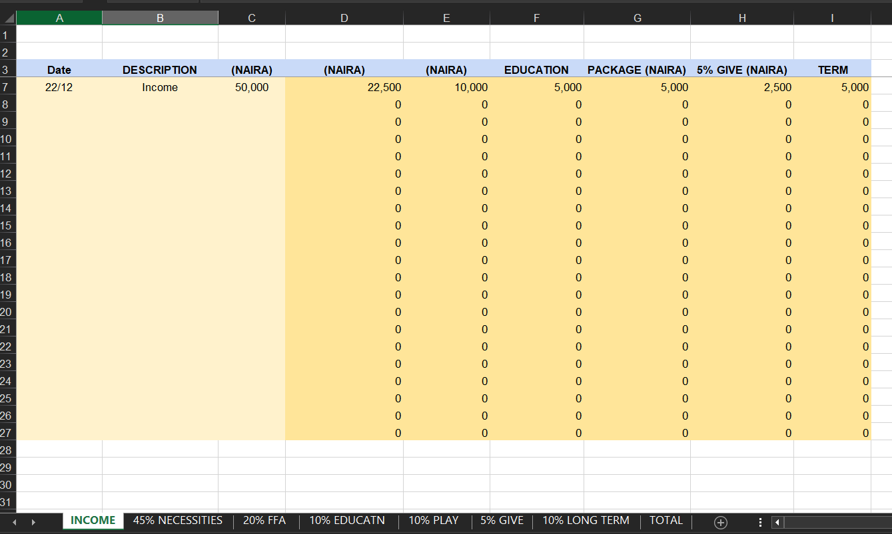

# Working With Excel Files

# Basics - Get value from a cell
first install `openpyxl `package on your computer

I have download my xlsx file



Sample code:

```python
import openpyxl as xl

wb = xl.load_workbook('bookkeeping.xlsx')

income_sht = wb['INCOME']
print(income_sht['b7'].value) # get b7 cell value
print(income_sht.cell(7,3).value) # Another way to get row and column cell
```

## Updating a column value


```python
import openpyxl as xl

wb = xl.load_workbook('bookkeeping.xlsx')

income_sht = wb['INCOME']

for row in range(4, 7+1):
    # income amount
    inc_amount = income_sht.cell(row, 3).value
    print(inc_amount)

    # corrected 'neccesity amount' 
    necc_amount = float(inc_amount)* 0.5

    # get cell in 'neccesity col' and update it 
    necc_cell = income_sht.cell(row, 4)
    necc_cell.value = necc_amount

# create a copy of the excel file
wb.save('bookkeeping2.xlsx')
```
