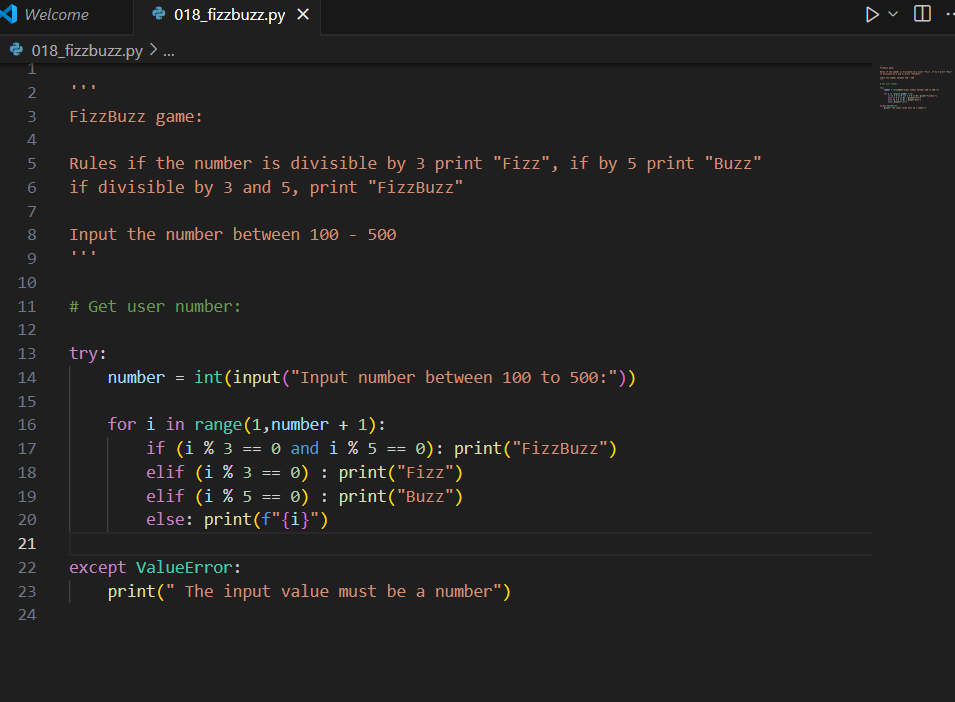

# day 5 

I learnt how to code "FizzBuzz" today. The first error was not write the if statement for checking `num % 3 and num % 5` first it came last. But when I ran the code, I spotted this error and made ammends.

